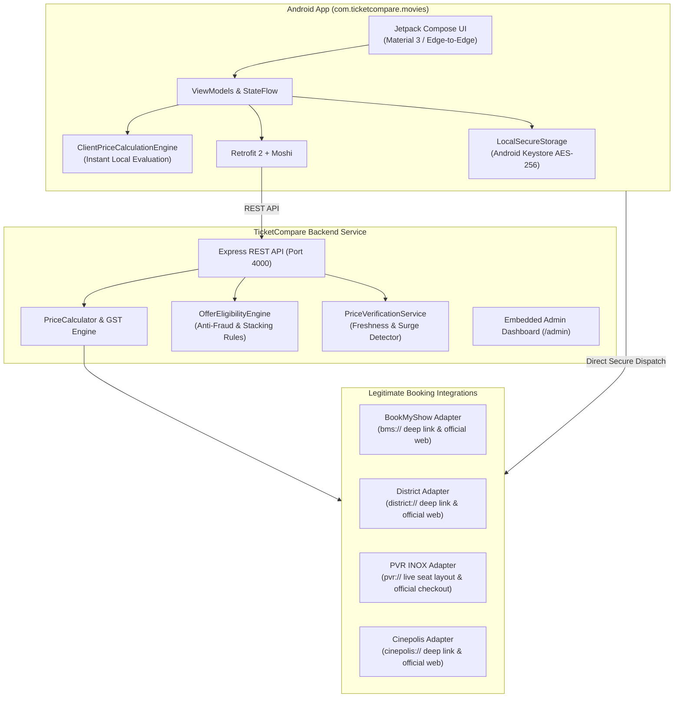

# TicketCompare — “Compare. Save. Book.”

> **The production-ready movie ticket price comparison & offer optimization platform.**
> **Core Purpose:** *Find the cheapest legitimate way to book a movie ticket by comparing the COMPLETE final payable amount.*

Package Name: `com.ticketcompare.movies`  
Platform: Android (Jetpack Compose + Material 3) & Node.js/TypeScript REST Backend Service

---

## 1. Executive Summary & Core Philosophy

Movie ticket booking platforms often advertise a base ticket price (e.g. ₹200), but at checkout add convenience fees, internet handling charges, and 18% GST—often pushing the price to ₹260+. Meanwhile, payment offers (HDFC 25% off, SBI Card flat ₹100, Google Pay cashback, or PVR Passport perks) significantly alter which platform is truly the cheapest.

**TicketCompare solves this by calculating the COMPLETE final payable amount upfront:**

$$\text{Base Ticket Price} + \text{Convenience Fee} + \text{Internet Handling Fee} + \text{GST (18\% on fees)} - \text{Instant Discounts} = \textbf{FINAL PAYABLE AMOUNT}$$

$$\textbf{Effective Cost} = \textbf{FINAL PAYABLE AMOUNT} - \textbf{Post-Payment Cashback}$$

> [!IMPORTANT]
> **Strict Anti-Deception Policy:** TicketCompare strictly separates **Instant Discount** (which reduces the money deducted at checkout) from **Post-Payment Cashback** (which is returned after transaction completion). Cashback is never misleadingly displayed as an upfront price deduction.

---

## 2. System Architecture



---

## 3. Supported Booking Providers & Legal Compliance

In compliance with provider terms and security practices, **TicketCompare never scrapes websites unlawfully, never bypasses CAPTCHAs, and never creates fake bookings.**

| Provider | Integration Type | Seat Layout API | Convenience Fee Per Ticket | Protocol / Deep Link |
| :--- | :--- | :--- | :--- | :--- |
| **BookMyShow** | Authorized Deep Link / Partner Feed | Redirects to BMS Official Layout | ₹28 + ₹5 + 18% GST | `bms://movie/{movieId}/show/{showId}` |
| **District** | Authorized Deep Link / Partner Feed | Redirects to District Layout | ₹18 + ₹5 + 18% GST | `district://movies/{movieId}/show/{showId}` |
| **PVR INOX** | Official Partner API & Deep Link | Live Interactive Layout (`D1..D10`) | ₹15 + ₹5 + 18% GST | `pvr://book?showId={showId}` |
| **Cinepolis** | Authorized Deep Link / Partner Feed | Redirects to Club Cinepolis | ₹16 + ₹5 + 18% GST | `cinepolis://show/{showId}` |

*Where an official provider API does not expose direct seat reservation or checkout endpoints, TicketCompare returns `NOT_SUPPORTED` and safely displays: **“Seat selection will continue on the provider's official booking page.”***

---

## 4. Dedicated Offer Engine & Stacking Rules

The backend Offer Engine models financial offers across major Indian financial institutions:

1. **Credit Cards**:
   - **HDFC Bank**: 25% instant discount up to ₹150 (Min order ₹400).
   - **ICICI Bank Gemstone (Coral/Sapphiro)**: 25% discount up to ₹100 (Min order ₹300).
   - **SBI Card (SimplyCLICK/AURUM)**: Flat ₹100 discount on weekends (Min order ₹500).
   - **Axis Bank (MyZone/Magnus)**: Buy 1 Get 1 Free up to ₹200.
   - **Kotak Bank**: 20% off up to ₹150 on weekdays.
2. **Debit Cards**:
   - **HDFC Debit Card**: 10% off up to ₹100 (Min spend ₹500).
   - **ICICI Debit Card**: Flat ₹75 discount (Min spend ₹450).
3. **UPI Offers**:
   - **Google Pay**: Assured scratch card up to ₹75 post-payment cashback (strictly separated from instant discount).
   - **PhonePe**: Flat ₹50 instant discount on District bookings.
   - **Paytm UPI**: ₹40 cashback into Paytm Wallet.
4. **Coupons**:
   - `SAVE100`: Flat ₹100 discount on orders above ₹500.
   - `MOVIE50`: Flat ₹50 discount on orders above ₹250.
   - `PVRPASS`: ₹75 discount on PVR INOX direct bookings.
5. **Memberships**:
   - **PVR Passport**: Zero convenience fee + flat ₹75 discount.

### Anti-Fraud & Stacking Enforcement
- **Bank Card Exclusivity**: Multiple bank card discounts cannot be combined.
- **Coupon Stacking Rules**: If an entered coupon code is mutually exclusive with bank card offers, the engine calculates which yields the highest financial saving and applies the optimal option.
- **Verification Timestamps**: All offers carry verified timestamps (e.g., *“Verified 5 minutes ago”*).

---

## 5. Security & Privacy Guarantees

- **Zero-Knowledge Card Storage**: The app **NEVER** asks for or stores card numbers, CVVs, expiry dates, OTPs, or UPI PINs.
- **Android Keystore Encryption**: Non-sensitive metadata (e.g. Bank name: *HDFC*, Card type: *Credit*) is encrypted locally using `EncryptedSharedPreferences` backed by the hardware-backed Android Keystore (`AES256_GCM`).
- **Secure Payment Redirect**: Final payment authentication occurs solely inside the official provider app or bank 3D-Secure portal.

---

## 6. Price Verification & Fluctuation Alerts (Requirement 17)

Before proceeding to external checkout, the app calls the Price Verification Service:
- Shows **“✓ Price verified 10s ago via official provider API”**.
- If a price jump occurs in dynamic cinema inventory:
  $$\text{“The ticket price changed from ₹450 to ₹475. Please review before booking.”}$$
  The user must review and acknowledge before proceeding.

---

## 7. Operational Setup & API Credentials

### Backend Service Setup
```bash
cd backend
npm install
npm test      # Runs Jest test suite
npm run build # Compiles TypeScript to dist/
npm start     # Starts production server on http://localhost:4000
```

### Accessing the Embedded Admin Dashboard
Navigate to `http://localhost:4000/admin` in any modern web browser:
- Monitor live provider health (BMS, District, PVR, Cinepolis).
- Re-verify or expire offers in real time.
- Simulate dynamic price surges (+₹25 on District) to test the Android app's price change detection.

### Android Application Setup
1. Open `TicketCompare/android` in Android Studio Ladybug or newer.
2. Ensure JDK 17 and Android SDK 34 are configured.
3. Build & run tests:
   ```bash
   ./gradlew testDebugUnitTest
   ./gradlew assembleDebug
   ```
4. Output APK location: `app/build/outputs/apk/debug/app-debug.apk`.

### Partner Integrations Requiring Official Partner API Access
| Partner | Partnership Portal / Program | Required Credentials | Fallback Strategy |
| :--- | :--- | :--- | :--- |
| **BookMyShow** | BMS Affiliate / Enterprise Partner Program | `BMS_PARTNER_KEY`, `BMS_API_SECRET` | Official Deep Link & Affiliate URL redirection |
| **District** | Zomato District Developer Portal | `DISTRICT_CLIENT_ID`, `DISTRICT_TOKEN` | Official App Scheme (`district://`) & Web Checkout |
| **PVR INOX** | PVR Corporate API Integration | `PVR_API_KEY`, `PVR_TERMINAL_ID` | Direct Booking URL & PVR Passport verification |
| **Cinepolis** | Club Cinepolis Merchant Portal | `CINEPOLIS_MERCHANT_KEY` | Cinepolis deep link |

---

## 8. License & Disclaimer

TicketCompare is built for fair consumer transparency and price optimization. All trademarks, service marks, and company names are the property of their respective owners.
